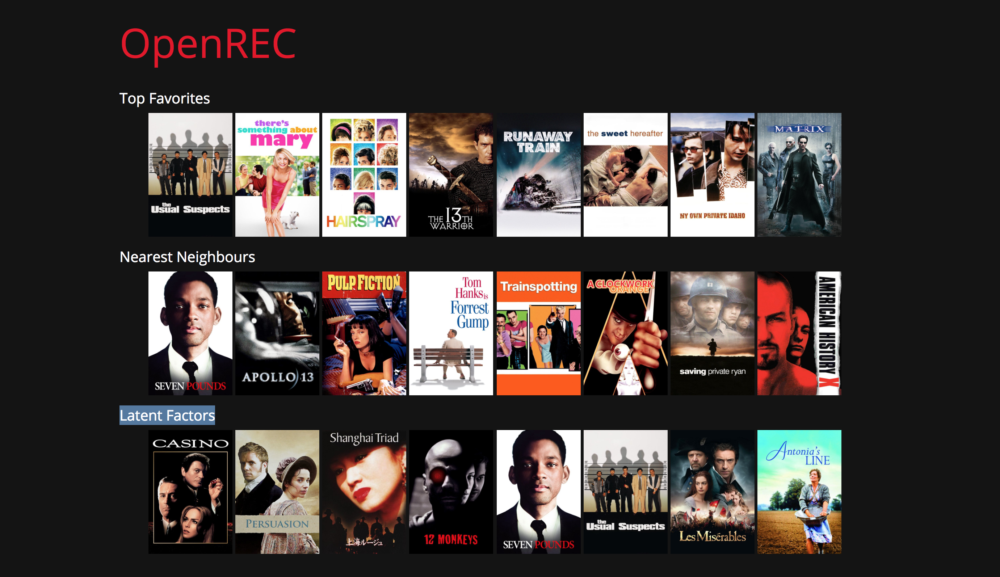

# open-rec

**open-rec** is a primitive recommendation system. The goal of this project is 
to gain a better understanding of recommendation systems and how they work in 
practice.

## Project Status

It is still a work in progress.

**Completed**

- [x] Redefine workflow (training sessions, data processing, presenting, user usability)
- [x] Train data and write output to files
- [x] Read from files (instead of waiting for worker to run) and serve them through web pages
- [x] Use [TMDb API](https://www.themoviedb.org/documentation/api) to find posters

**Ideas**

**Issues**

- [ ] Latent factor method is not working for user 101 -> cause deadlock

## Table of Contents

- [Theory](#theory)
- [Dataset](#dataset)
- [Structure](#structure)
- [Flow](#flow)
- [APIs](#apis)
- [Usage](#usage)

## Theory

Here is a write-up for the [theory](THEORY.md).

## Dataset

The dataset that I am using is [MovieLens 100K Datasets](https://grouplens.org/datasets/movielens/)

> Small: 100,000 ratings and 1,300 tag applications applied to 9,000 movies by 
> 700 users. Last updated 10/2016.

## Structure

**Main**

- `open_rec.py`: OpenREC object that has recommender logic, using collaborative filtering methods.
- `worker.py`: Enable OpenREC to execute different methods in parallel.
- `config.py`: Configuration hub.
- `persister.py`: Read and write trained data to disk.
- `presenter.py`: Read and process data and get posters links.
- `server.py`: Serve a webpage with RESTful API.

**Other**
- `build_data.py`: Handy program to train data across users.
- `collaborative_filtering.py`: Straightforward implementation of collaborative filtering methods.

## Flow

- Configure data location and number of steps: `config.py`.
- Train data: `open_rec.py` + `worker.py`.
- Save results to disk: `persister.py`.
- Read from disk and display: `presenter.py` + `server.py`.

## APIs

Endpoint | Description
--- | ---
`/` | Welcome page 
`/user/<int:ID>/data` | Return user's data in JSON
`/user/<int:ID>/poster` | Return user's data with TMDb posters links in JSON
`/user/<int:ID>/view` | Present the result in web page 

## Usage

- Configure in `config.py`.
- Train data with `python3 build_data.py`.
- Setup a server to see the results in web interface by `python3 server.py`. Default port is 5000,
  endpoints are presented above.
