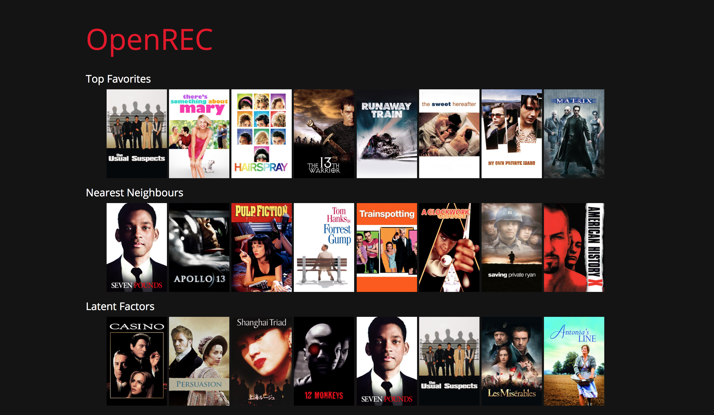

# open-rec

**open-rec** is a primitive recommendation system. The goal of this project is 
to gain a better understanding of recommendation systems and how they work in 
practice.

## Project Status

It is still a work in progress.

**Completed**

- [x] Redefine workflow (training sessions, data processing, presenting, user usability)
- [x] Write output to files
- [x] Read from files (instead of waiting for worker to run) and serve them through web pages

**Ideas**

- [ ] Given a movie name in text form, find a corresponding images (doesn't have to be movie posters)

**Issues**

- [ ] Latent factor method is not working for user 101 -> cause deadlock

## Table of Contents

- [Theory](#theory)
- [Dataset](#dataset)
- [Structure](#structure)
- [Testing](#testing)
- [Flow](#flow)
- [APIs](#apis)

## Theory

Here is a write-up for the [theory](THEORY.md).

## Dataset

The dataset that I am using is from [MovieLens 100K 
Datasets](https://grouplens.org/datasets/movielens/)

> Small: 100,000 ratings and 1,300 tag applications applied to 9,000 movies by 
> 700 users. Last updated 10/2016.

Movies' posters are powered by [TMDb](https://www.themoviedb.org).

## Structure

> TODO

## Testing

Configure in `config.py` and execute the command `./run.sh`.
This runs the program for a target user and dumps the output to a file in
[output](output) folder.
The file is stored under the format `Y-M-D_H:M:S.txt` where the current time
(year, month, data, hour, minute, second) is snapshot at runtime.

## Flow

- Save the results of training sessions to disk.
- Use these to build a Netflix-like interface (need to auto find movies' covers
  somehow).

## APIs

Endpoint | Description
--- | ---
`/user` | List all available users ID
`/user/<int:ID>` | Show the user's profile with given ID
`/user/<int:ID>/raw` | Show the user's raw metrics from different methods
`/dashboard` | Compare different results?
