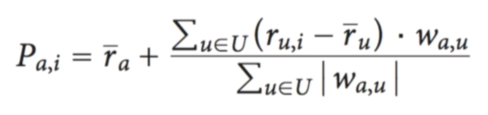

# Recommender system
*Reference: [Byte-Sized-Chunks: Recommendation
Systems](https://www.udemy.com/recommendation-systems/)*

High quality, personalized recommendation system are the holy grail for every
online stores today, wherever they are selling books, musics, or electronics.
Amazon, Spotify, Netflix are the best examples since their services are
entirely based on how good they recommend to users in in order for them to
continue using their products.

The end goal for online store is either revenue or engagement. Amazon wants
their users to spend as much time on their website to buy things that they
like. For subscription-based service like Spotify or Netflix, they want users
to spend time using their subscription services as much as possible and be
addicted to their services.

Unlike, online stores have no sales people but a huge number of products. Users
have a limited time and patient and most of the time are unsure about what they
are looking for. The recommender systems help users navigating through the maze
of online stores as well as finding what they are looking for quickly. They
also help users find things that they might like but did not know of. In
general, recommender systems solve the problem of discovery.

## Recommendation Engine

A recommendation engine takes all the user's history and the product-related
data then filter out relevant for that particular user. For each product, it
might predict what rating the user would give to a product, whether the user
would buy a product or not. It might also rank products based their relevance
to the user.

The world "relevant" could be used in many contexts. It can be what user have
bought or searched for on the website. For example, if you are interested in
Machine Learning then Machine Learning textbooks are relevant recommendations for
you. It could be something that can be used with the thing that you are looking
at right now. For example, a text on R might help even though it doesn't cover
Machine Learning topics. If you are buying a camera, camera's accessories like
lens or tripods might be useful and relevant for you.

There are different ways to find these relevant products. One way is to find
the products that are similar to the one user liked (content-based filtering).
Another way is to look for the ones that are liked by similar users
(collaborative filtering). We can also find the products that
are purchased along with the ones that user like (association rules).

**How do we know if a user like a product?**

These are the products that user purchases recently, clicks on, adds to cart or
rate highly. If the user rates something low, that also means something.
Sometimes, stores also ask for explicit input from user.

## Content-based filtering

Given a user, content-based filtering has to find products that are similar to
the products that user already like. The similarity of products is defined by
content of these products being the same. For example, if the content of two
books or two movies are similar. It could even be the description
characteristics of the two products, such as the color of two types of
shoes or the brands you trust.

Content-based filtering is normally used with text documents, such as news,
books or articles. First we start by identifying factors which describe and
differentiate products. With those metrics, we decide if the user like the
product or not. Then we will express these products in term of their
descriptors. Example of attributes for books are genre (science fiction,
comedy, drama), the words are that used in these books, the styles of writing
or the authors. We then map all the products to the factors. A user's profile
is created by using the same terms.

This key challenge in content-based filtering is to answer two questions:
- "What attributes should?"
- "How are these generated?"

Typically, we will need to manual data collection. For text documents, we could
use NLP to generate descriptors. It could be as simple as counting word
frequencies in documents. Then we could find the nearest neighbours for the
terms. For different kind of documents such as movies or songs, we need to
manually collect data every product and user is mapped against the factors that
we identify. This is also the reason that content-based filtering is less
common.

The most successful example of content-based filtering is the music genome
project owned by Pandora. It is a massive project that aims to build
descriptors for every song they have in their database. Every song is
represented by a vector of 450 "genes". Trained musical analysts score each
song on the 450 attributes. The process takes 20-30 minutes per song. The radio
then keeps playing songs that match the user's preferences.

## Collaborative filtering

What if we could recommend products without knowing anything about the products
themselves? Unlike content-based filtering, collaborative filtering doesn't
require any product description at all. Normally, if we want to find a movie to
watch, restaurant to go to, an artist to check out or a book to read, we ask a
friend who likes the same things as us. Therefore, the basic premise here is:
if 2 users have the same opinion about a bunch of products, they are likely to
have the same opinion about other products as well. For any algorithm that
relies only on user behaviors such as users’ history, ratings and so on, the
algorithm normally predicts user’ ratings for products they haven’t rated yet.
Rating can mean that a user likes a product. Explicitly, in the case of
Netflix, it asks user to rate a movie once they have watched it. Implicitly, we
can learn it from users’ clicks, purchases, searches.

There are many different algorithms to perform collaborative filtering. Two
most popular techniques are: nearest neighbour based methods and latent factor
based methods.

### Nearest neighbour based methods

The objective is to predict a user's rating for a product they haven't rated
yet. This is done by finding the neighbours of the active user. The solution is
to find the k-nearest neighbours of that user and take a weighted average of
their ratings for products. Intuitively, in order to find how a person would
like a product or not, find users that are similar to that user and take a
weighted average of their opinions.

Users who give the same ratings for a bunch of products are said to be similar
to each other. For example, two users rate same movies really high or they both
hate the same movies. If we can find the k-nearest neighbours that are most
similar to the active user then we can use their ratings for different products
to predict how this user react to a bunch of products.

We start by building a item-rating matrix, where we present users by their
ratings for different products. This matrix has n rows for all the n users in
our database and m columns for the entire list of products. It presents every
user's rating for every product that one has ever rated. Of course there are
some items which haven't been rated by a particular user or some users that
haven't rated some particular items. This happens in real life because most
users would not have rated a lot of of items and most items would not have been
rated by many users. Those particular cell will is presented as NaN.

```
        Item 1  Item 2  Item 3  Item 4  Item 5  ... Item m
User 1    4       -       4       -       -           -
User 2    -       3       4       -       -           -
User 3    5       3       2       -       5           -
User 4    2       -       2       -       -           -
User 5    4       -       4       5       -           -
     .
     .
     .
User n    4       -       4       5       -           -
```

Nearest neighbours are found using a similarity or distance metric. There are
different ways to find the similarity between 2 vectors:
- Euclidean Distance
- Cosine similarity
- Pearson correlation

**Euclidean Distance**

<p align="center"></p>

It is the distance measured between two points in any space. We can use the
Pythagorean theorem in any n-dimensional space to calculate the hypotenuse.

**Cosine similarity**

<p align="center"></p>

Find the angle between two vectors and that will be the cosine similarity. The
lower the cosine, the more similar these vectors are.

**Pearson correlation**

<p align="center"></p>

Given any two variables, the correlation is the measure of how similar of those
variables are or how similar the changes in those variables are. The Pearson
correlation is nothing but a correlation that you would normally measure when
you try something to do something like a linear regression. It is analogous to
cosine similarity after adjusting by the respective means. The vectors here are
users' ratings for different products. Each certain will have a certain bias.
Some will rate movies but some might have a tendency to rate everything low.

**How do we account for these biases?**

One way could be to normalize users' ratings by their average ratings. This is
exactly what the Pearson correlation does.

In our case, we need to find the predicted rating of active user a for product i.

<p align="center"></p>

1. Start with the average rating of the active user a for any product.
2. For each neighbour (U is the set of nearest neighbours of active user a), add
   the rating of a user u for product i, but adjust the neighbours' ratings by
   their average ratings and the similarity between user u and active user a.

**How do we find the top picks for a user?**

We need to predict the ratings for products the user hasn't bought or seen.
Then pick the top n rated products.

**Discussion**

Nearest neighbour based methods are also called memory based methods. They
usually involve in-memory calculations on the entire (or a large part) of the
user rating database. In order to find the nearest neighbours of a particular
user we have to find the distance between that user and all the other users in
the user database and sort them by their distances to find the nearest
neighbours. This requires a huge amount of calculation. Therefore, it is a 
challenge for scalability.

The collaborative filtering we have seen so far is user centric. We could also
perform item centric collaborative filtering. The neighbours could be the
nearest neighbours of a product rather than users.

### Latent factor based methods

The basic idea behind latent factor based methods is to take users and their
ratings for different products and then identify hidden factors that influence
a user's rating. The idea for this comes from a concept called Latent semantic
indexing which is a way to find hidden factors which explains a document or a
piece of text. This is analogous to content-based filtering except that the
factors are identified by the learning algorithm. Sometimes the factors might
turn out to have meaning. Other times, they might be abstract factors with no
real life meaning.

Taking the same first step as in nearest neighbour based methods, we represent
users by their ratings for different products. Given that matrix, we factorize/
decompose it, into 2 matrices, one where users are mapped onto hidden factors and
one where items are mapped onto hidden factors.

<p align="center"></p>

Each column in Q is a product described by the hidden factors. Each product is
presented by what amounts of how much, how strong their possessions of each of
the factor. This could be a positive or negative number. Similarly, each row in
the user-factor matrix P is a user described by their interests in the hidden
factors. This method is called matrix factorization. It was invented and
populated by the Netflix prize winners. It performed better than the old
method, which was heavily neighbourhood based.

The objective of matrix factorization is to decompose each user rating into a
user-factor vector and a product-vector factor. This is analogous to what
happens in standard linear algebra's Singular Value Decomposition or Principal
Component Analysis. Both of these are very popular matrix factorization
technique. However, these techniques would only make sense if we know all the
rating for all the users for all products, which means there are no missing
values in the user item rating matrix. Therefore, the question becomes "How do
we perform matrix factorization when the rating matrix has so many missing
values?". 

The solution is, we only solve for the ratings which are available
and completely ignore the missing values. Each rating has to be decomposed into
2 vectors. We can write an equation for each rating of an item i by user u. We
can solve this set of equations for the set of ratings which exist (training
set) then use the result to find the rating of any user for any product. In
order to solve this set of equations, we need to find the set of factor vectors
p, for each user u, and q, for each item i, which minimize the error in the
training set. What if we find too many hidden factors that overfit the training 
set? We need to penalize models with higher number of factors. To solve this
optimization problem, there are standard optimization techniques, such as
Stochastic Gradient Descent and Alternating Least Squares.

<p align="center"></p>

**Stochastic Gradient Descent**

1. Initialize some values of p and q.
2. Find the current values of the error functions.
3. Find the slope at the current point and move slightly downwards in the
   position.
4. Repeat until we reach a mimimum.

<p align="center"></p>

However, Stochastic Gradient Descent doesn't guarantee the global minimum
because it depends on where your initial values are. If our initial values of p
and q are in such a place that if we move downward from there, we will reach
the local minimum, then we will never reach the global minimum.

**Alternating Least Squares**

1. Fix the value of one variable, for example p, and solve for the other 
   variable, q.
2. Repeat until the value of p and q converge.

**Discussion**

Matrix factorization is one of the techniques that provides a big jump in the
improvement of the errors. However, there are also other techniques that are
nice to look at as well, such as normalizing for user biases and
temporal effects. Both of these have big impacts in improving matrix
factorization even further. The idea of user biases is to account for biases
that some users might have. Some users tend to rate products
higher in general and some rate them low. It might be the case that some
products induce biases. For example, most people will rate
the movie Inceptions high because they just of that particular director and
that kind of movies. Temporal effects account for the fact that users'
interests can be changed along with time.

**Common challenges**

> Cold start: How to deal with new products or users with no history?

Collaborative filtering relies on user history. It doesn't use any products'
descriptors or users' demographic. What should we do when we have products
which no users has rated yet or users that has no ratings yet. The answer is to
use content-boosted collaborative filtering. This is the combination of
content-based filtering and collaborative filtering. We could use products
attributes, like genre, product's content or users' demographic to find similar
users and then augment collaborative filtering.

> Data sparsity: What to do when our ratings data is very sparse?

Online stores normally have a huge number of products and a huge number of
users. There are very few products that are rated by multiple users and very
few users have rated the products. When we try to build the user item rating
matrix and find the similarity between users or matrix factorization, we end up
with a matrix which is very sparse. This is a problem because we have a huge
matrix but not many users contribute to the learning process but they make the
computation inefficient and expensive. Dimensionality reduction comes to our
rescue here. We can remove unimportant dimensions, unimportant users or
products where we are not learning much and reduce the sparsity of the user
item rating matrix.

> Gray sheep: Are there some kind of users that collaborative filtering won't
> work for?

Collaborating filtering relies on this idea that: if two users have the same
opinions some things, they have similar opinions about other things as well. A
grey sheep is someone whose opinion is not consistent. This can be very common.
For this kind of users, content-based filtering become important.

> Synonymy: How to deal with products which are basically the same but with
> different names?

There are some products that are practically the same, such as different
editions of a books or ebooks vs physical copies. Normally, stores would have
different product codes for each of those. Since collaborative filtering
doesn't use any products' descriptors, it might miss out this information.
Latent factor based collaborative filtering techniques have been seen to
identify synonyms very well. If we have a set of data that might have synonymy
problem, it's better to go with latent factor based collaborative filtering
rather than neighbourhood based one.

> Shilling attacks: How to deal with users that are trying to game the system?

There might be some authors that give tons of positive fake ratings for their
own content and negative ones for other content. Taking precautions against
these can make the recommendation system more robust.

## Association rules
